<div align="center">

# � Plant Disease Detection AI

<p align="center">
  
  
  
</p>

### 🚀 **AI-Powered Plant Disease Detection in 7 Lines of Code**

**ตรวจจับโรคพืช 12 ชนิด จากภาพถ่าย ด้วย YOLOv26 ที่เทรนจาก 5,500+ ภาพ**

<br>

<p align="center">
  
  
  
</p>

---

## ⚡ **Quick Start - 3 Steps**

```bash
# 1️⃣ Clone & Install
git clone https://github.com/0x90Vold/Plant-Disease-Detection.git
cd Plant-Disease-Detection
pip install ultralytics

# 2️⃣ Replace "leaf_photo.jpg" with your image
# 3️⃣ Run Detection
python main.py
```

**That's it! 🎉 The AI will detect diseases and show results**

</div>

<br>

---

<br>

## 🎯 **Performance Metrics**

<div align="center">

<table>
<tr>
<td align="center">
  
  <br><sub>Primary Accuracy</sub>
</td>
<td align="center">
  
  <br><sub>True Positive Rate</sub>
</td>
<td align="center">
  
  <br><sub>Disease Detection Rate</sub>
</td>
<td align="center">
  
  <br><sub>Overall Accuracy</sub>
</td>
</tr>
</table>

<br>

**🏆 Trained on 5,493 images • 100 epochs • YOLOv26 Nano**

</div>

<br>

<details>
<summary><b>📈 กราฟผลลัพธ์ (คลิกเพื่อดู)</b></summary>

<br>

<div align="center">

**Training Results**

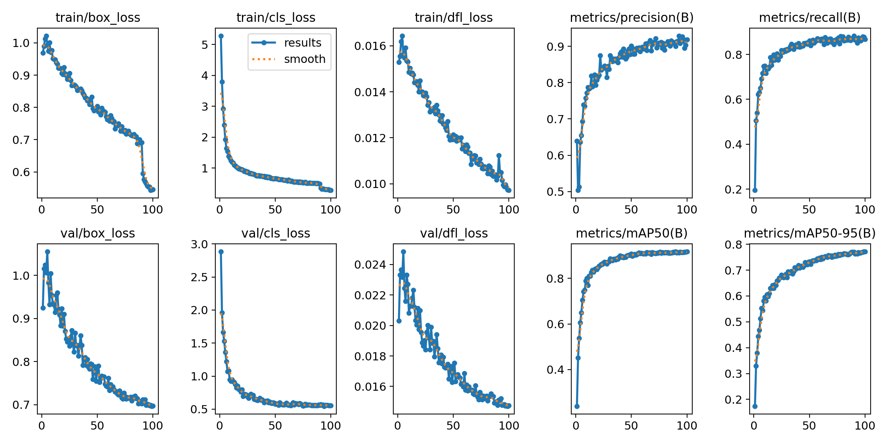

<br>

**Confusion Matrix**

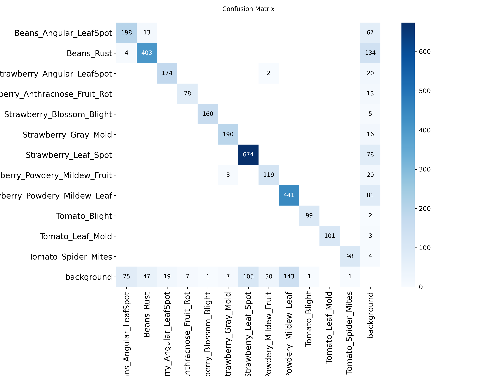

<br>

**Confusion Matrix (Normalized)**

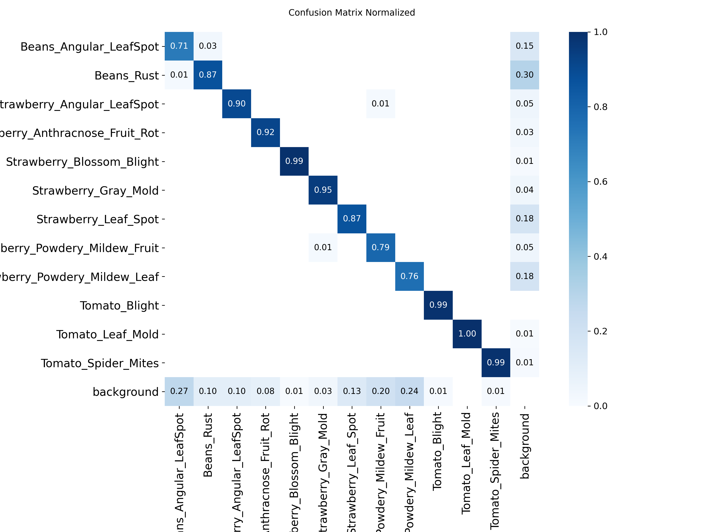

<br>

**PR Curve**

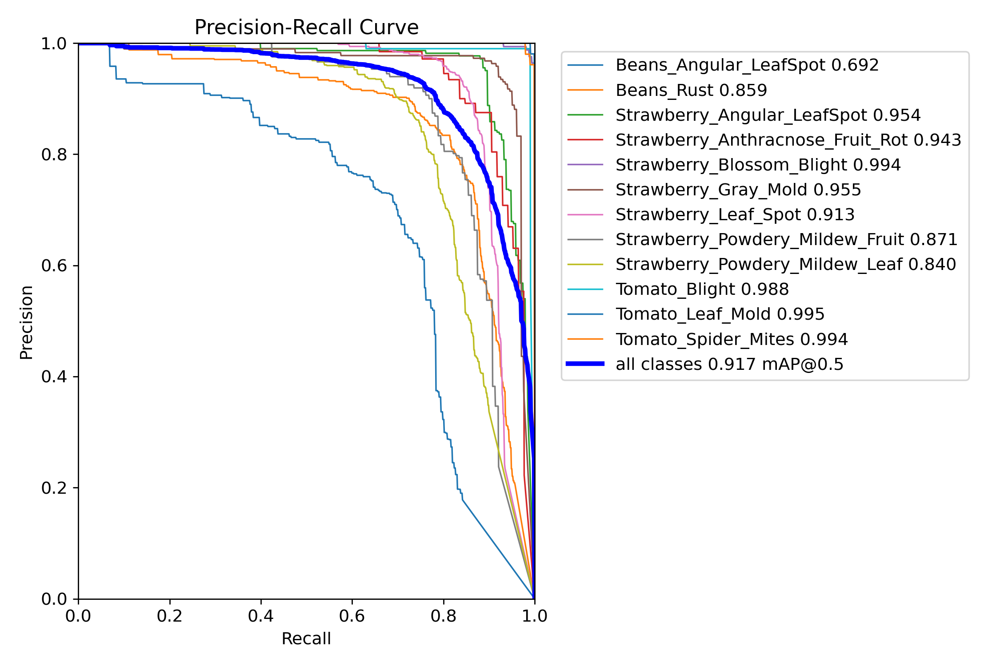

<br>

**F1 Curve**

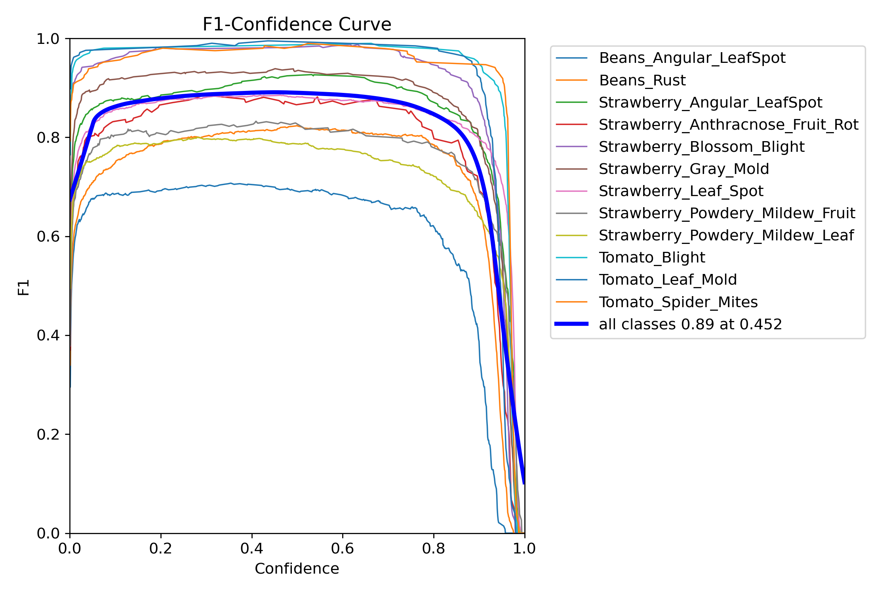

</div>

</details>

<br>

<details>
<summary><b>🖼️ ตัวอย่าง Prediction vs Ground Truth (คลิกเพื่อดู)</b></summary>

<br>

<div align="center">

| Ground Truth | Prediction |
|:---:|:---:|
| 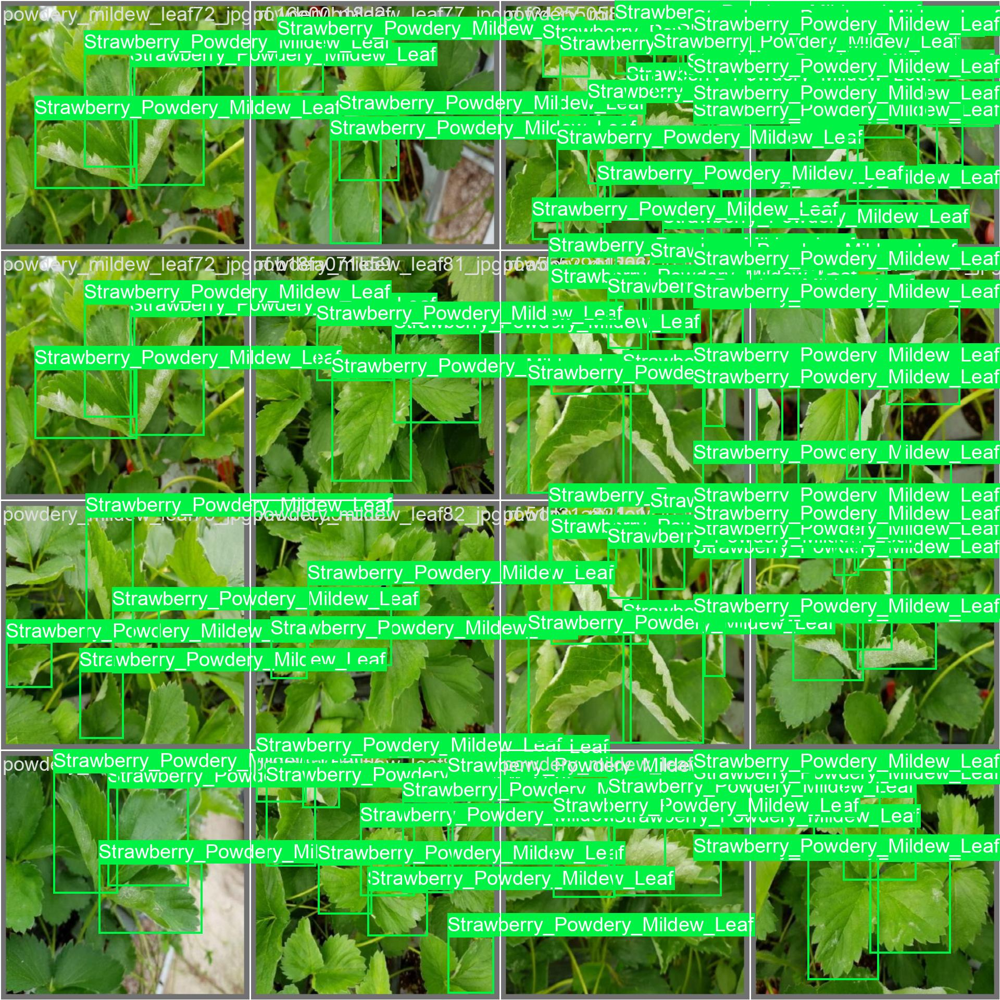 | 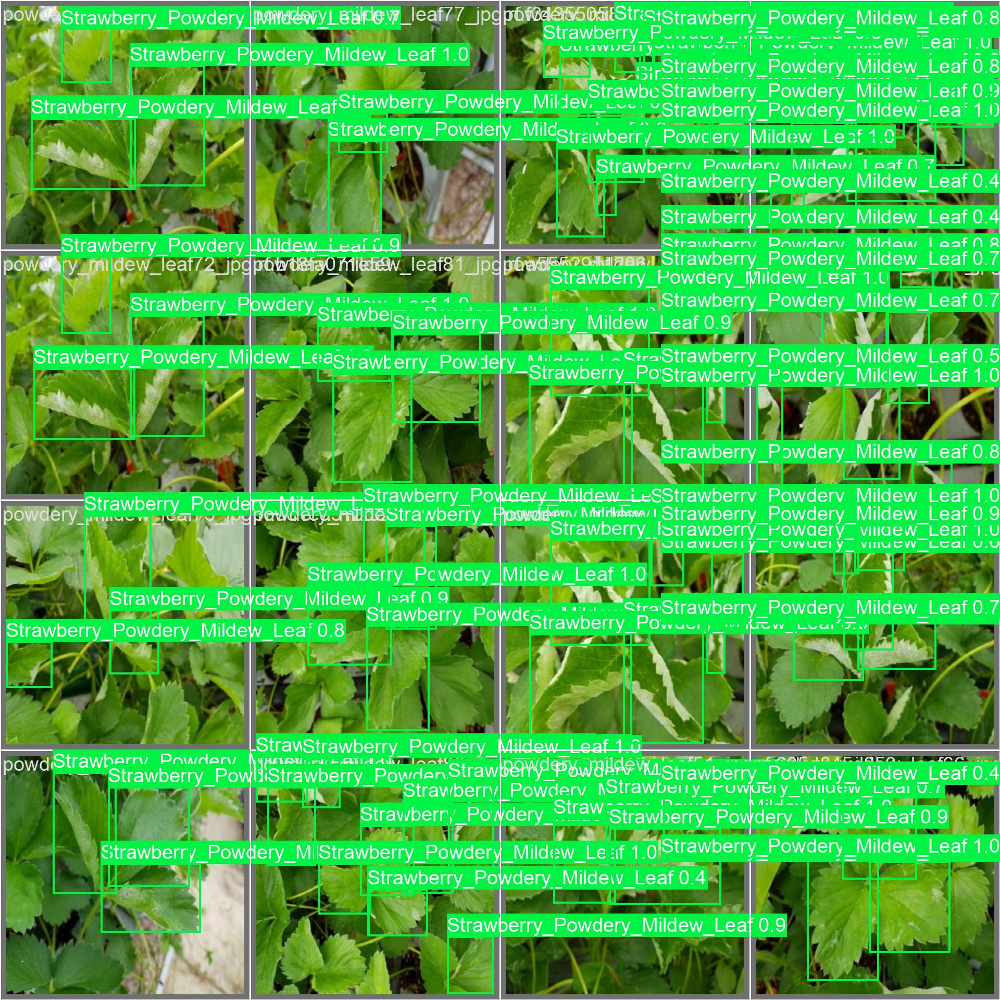 |
| 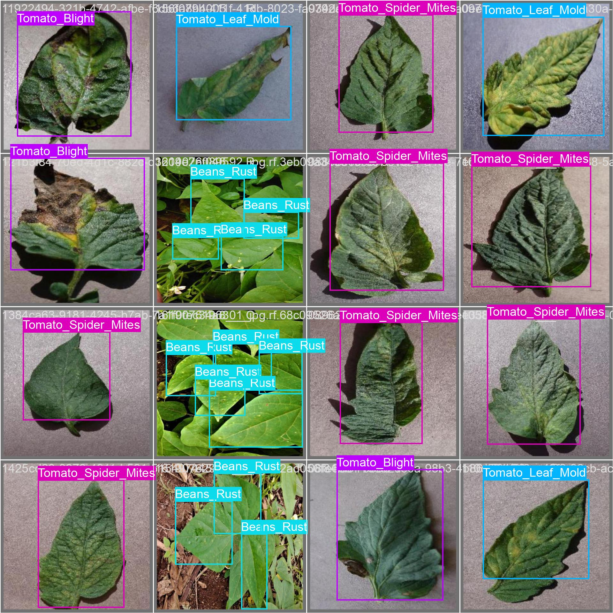 | 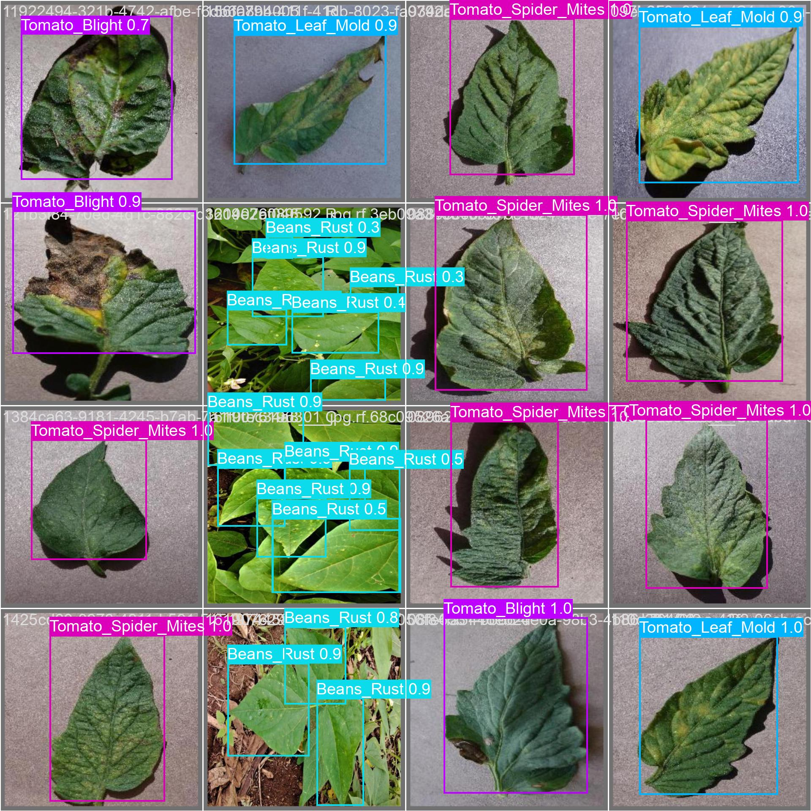 |
| 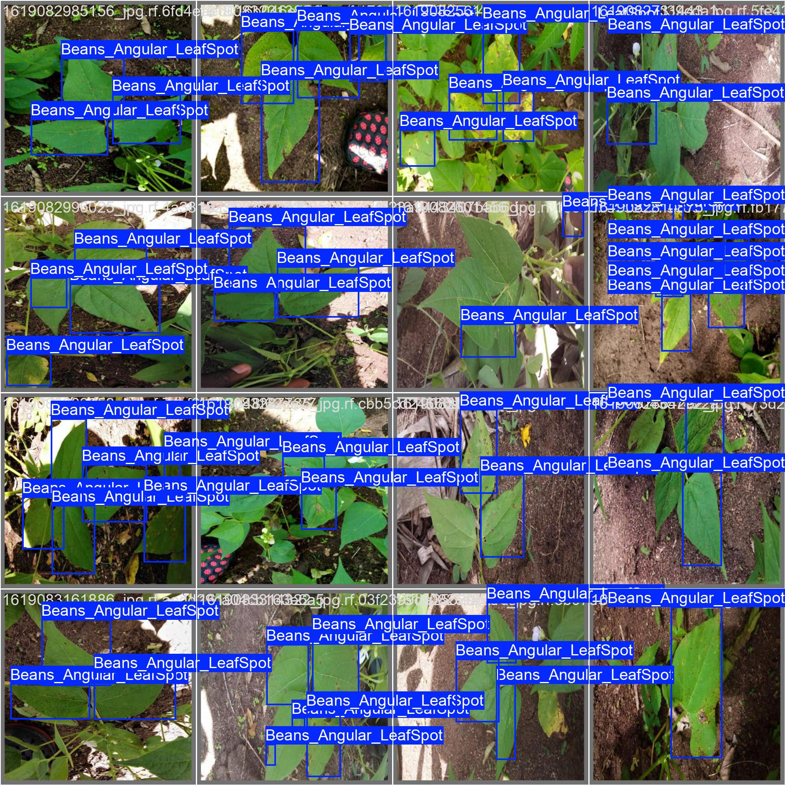 | 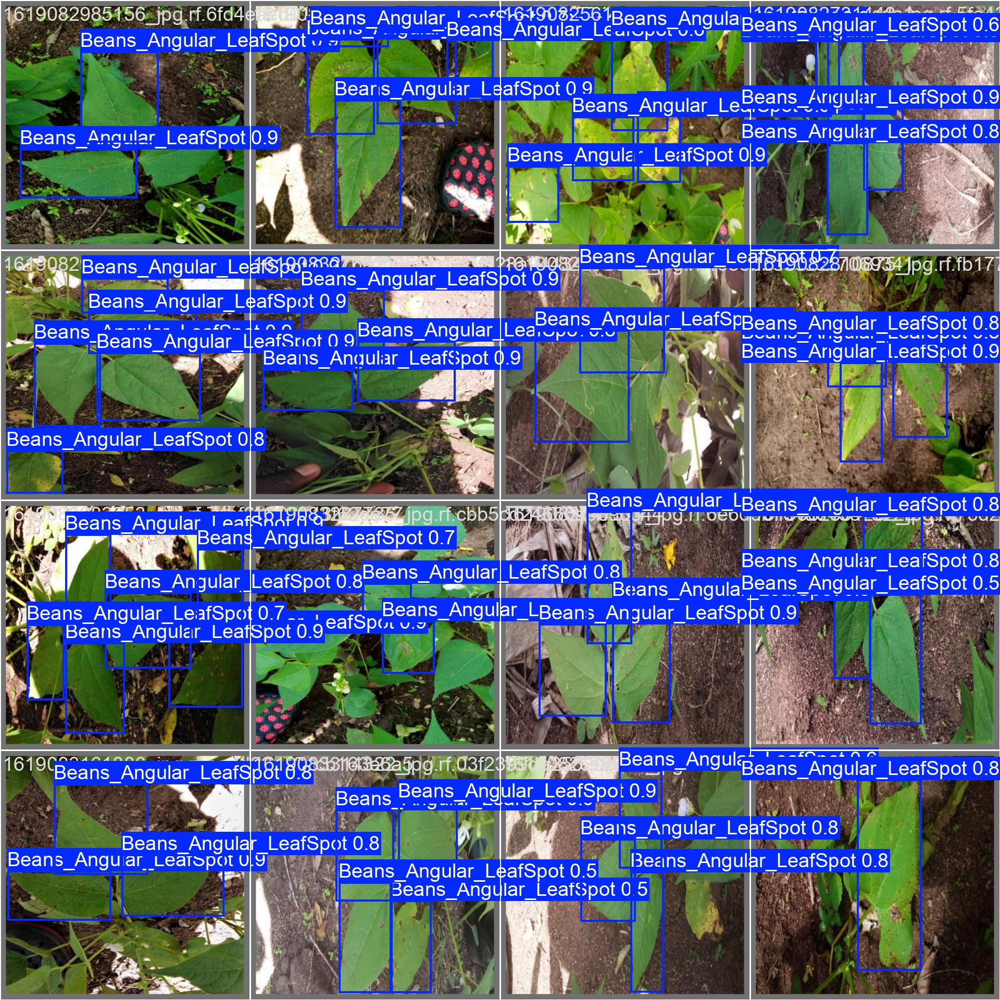 |

</div>

</details>

<br>

---

<br>

## � **Code Example**

<div align="center">

**The entire detection code is just 7 lines!**

```python
from ultralytics import YOLO

model = YOLO("runs/detect/train/weights/best.pt")

results = model.predict("leaf_photo.jpg", conf=0.5) # ใส่ภาพตรงนี้ 

results[0].show()
```

<br>

<table>
<tr>
<td align="center">
  
  <br><sub>Load Framework</sub>
</td>
<td align="center">
  
  <br><sub>AI Brain Ready</sub>
</td>
<td align="center">
  
  <br><sub>Detect Disease</sub>
</td>
<td align="center">
  
  <br><sub>View Results</sub>
</td>
</tr>
</table>

</div>

<br>

---

<br>

## 🦠 **Supported Plant Diseases**

<div align="center">

### **12 Disease Types Across 3 Crops**

<br>

<table>
<tr>
<td align="center" width="33%">


<br><br>

• **Angular Leaf Spot**  
• **Rust**

</td>
<td align="center" width="33%">


<br><br>

• **Angular Leaf Spot**  
• **Anthracnose Fruit Rot**  
• **Blossom Blight**  
• **Gray Mold**  
• **Leaf Spot**  
• **Powdery Mildew (Fruit)**  
• **Powdery Mildew (Leaf)**

</td>
<td align="center" width="33%">


<br><br>

• **Blight**  
• **Leaf Mold**  
• **Spider Mites**

</td>
</tr>
</table>

</div>

<br>

---

<br>

## � **Project Structure**

```bash
� Plant-Disease-Detection/
│
├── � main.py                    # 7-line detection script
├── ⚙️ requirements.txt           # Dependencies  
├── � data.yaml                  # Dataset config
├── 🧠 yolo26n.pt                 # Pre-trained weights
│
├── 📁 runs/detect/train/         # Training results
│   ├── 🎯 weights/best.pt        # Trained model (ready to use!)
│   ├── 📈 results.png            # Training graphs
│   ├── 🔍 confusion_matrix.png   # Performance analysis  
│   └── 📊 validation_results/    # Prediction examples
│
└── 📁 train/valid/test/          # Dataset (5,493 images)
```

---

## ⚡ **Technical Specifications**

<div align="center">

<table>
<tr>
<td align="center">
  
  <br><sub>Lightweight & Fast</sub>
</td>
<td align="center">
  
  <br><sub>High Quality Data</sub>
</td>
<td align="center">
  
  <br><sub>Optimal Balance</sub>
</td>
<td align="center">
  
  <br><sub>Fully Converged</sub>
</td>
</tr>
</table>

</div>

---

## 🤝 **Credits & Acknowledgments**

<div align="center">

<br>

**Built with powerful open-source tools**

<br>

<table>
<tr>
<td align="center" width="50%">
  
  <br><br>
  <sub>High-quality annotated dataset from <a href="https://universe.roboflow.com/artificial-intelligence-82oex/detecting-diseases/dataset/6">Roboflow Universe</a></sub>
</td>
<td align="center" width="50%">
  
  <br><br>
  <sub>YOLOv26 model powered by <a href="https://github.com/ultralytics/ultralytics">Ultralytics</a></sub>
</td>
</tr>
</table>

<br><br>

---

<br>


<br>

<sub>**Made with 💚 for smarter agriculture and better crop health**</sub>

<br><br>

</div>
